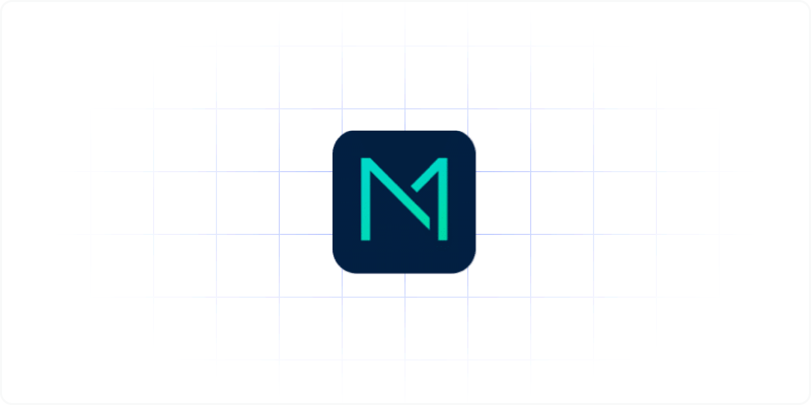

# ModelBank: A dynamic PSD2 Sandbox environment for realistic TPP integration testing

This is adorsys ModelBank: a dynamic sandbox environment that fully meets the PSD2 requirements for providing APIs for Third-Party Providers (TPP). Based on the Berlin Group’s NextGen PSD2 specification for access to accounts (XS2A), ModelBank meets all the regulatory requirements and is NISP compliant. 

ModelBank is an open source (AGPL v3) try out solution. It is delivered as-is and comes without any warranty, to the extent permitted by applicable law.

**Caveat**: This repository is not the latest version of Modelbank as it runs with our enterprise clients. Do not use it for commercial purposes! This public repository will only be updated every 6 months or so. It may contain security related issues that are already fixed with our customers but did not make it to the public repository, yet.

**Enterprise Version**: There is an enterprise version of Model Bank that we proudly manage, adapt, extend, improve and operate for our enterprise clients, mostly European banks and open banking aggregators. This version consists of latest Berlin Group implementation of XS2A Core.

**Partnerships**: If you are an organization that would like to commercially use our solutions beyond AGPL v3 requirements, please get in contact. We currently focus on collaborative projects with our customers where our frameworks can be used as a basis for building new individual PSD2 solutions.

**Upcoming Regulation**: If you are interested in this project's further developments in the context of Berlin Group, Open Banking UK, PSD3, PSR, DORA and FIDA, please get in contact.

For any inquiries please write to [sales@adorsys.com](mailto:sales@adorsys.com).

## What is it

With PSD2 Directive (EU) 2015/2366 of the European Parliament and of the Council on Payment Services in the Internal Market, published 25 November 2016
the European Union has forced Banking Market to open the Banking Services to Third Party Service Providers (TPP). These services are accessible by TPP on behalf of a Payment Service User (PSU).

The 'Berlin Group' is a pan-European payments interoperability standards and harmonisation initiative. Based on the PSD2 and EBA RTS requirements, Berlin Group NextGenPSD2 has worked on a detailed [Access to Account (XS2A) Framework](https://www.berlin-group.org/psd2-access-to-bank-accounts) with data model (at conceptual, logical and physical data levels) and associated messaging.

ModelBank is a dynamic sandbox environment that allows to emulate and test ASPSP's OpenAPI PSD2 services.
Modelbank functionality supports all mandatory services of XS2A. Optional services are partially supported via UI interfaces, but fully supported and can be tested through XS2A interface.

ModelBank is based on [XS2A Service](https://github.com/adorsys/xs2a), [XS2A-connector-examples](https://github.com/adorsys/xs2a-connector-examples) and [Ledgers](https://github.com/adorsys/ledgers). ModelBank also uses Keycloak identity provider (IDP) for the security/token issues and for handling the system users.

With ModelBank [TPP UI](tpp-ui/), you as a testing TPP can access banking APIs directly, get TPP certificates and manage testing accounts. Administrators cannot login to TPP UI.

The ModelBank [Admin UI](admin-ui/) provides a user interface to manage administrators of the ModelBank, its users and TPPs. Please note, that TPPs cannot login to this application.

[Developer Portal](developer-portal-ui/) contains testing instructions and all the necessary documentation. Also, there is a possibility to send requests to XS2A system to proceed basic Payment and Consent flows available in test cases inside Developer Portal.

All four SCA approaches are supported: REDIRECT, OAUTH, EMBEDDED, DECOUPLED. Two of them (REDIRECT, EMBEDDED) are directly testable on Developer portal. For the Redirect SCA Approach an [Online Banking UI](oba-ui/) is used for authorisation and SCA.

## Project documentation

-   [Release notes](docs/releasenotes.adoc) contain information about changes included into releases.
-   [User Guide](docs/user-guide.md) describes how to configure the ModelBank.
-   [UI Customization guide](docs/customization_guide/UIs_customization_guide.md) describes how to customize Developer Portal, Online Banking UI, TPP UI and Admin UI.
-   [Architecture Documentation](docs/arc42/modelbank-arc42.adoc) describes the whole architecture of the project.
-   [Diagram Tools](docs/arc42/README.adoc) describes how to install, create and use tools for our diagrams.

## How to try it

-   [Running ModelBank instructions](docs/running-modelbank.md) will help you with getting a copy of the project up and running on your local machine.

## Version policy

In general ModelBank Team follows [SemVer](https://semver.org/) for versioning. This means our versions follow the model A.B.C, where:

-   A - is the major version, pointing out mainline.

-   B - is the minor version, pointing out the next release in the mainline.

-   C - is the hotfix version, used to deliver patches between releases when needed. If omitted, version 4.5 will be considered equal to 4.5.0.

We support one release version at the moment.

New version is released on a regular basis every 3 to 6 months.

## Development and contributing

Any person is free to join us by implementing some parts of code or fixing some bugs and making a merge requests for them.

[Contribution Guidelines](docs/Contribution-Guidelines.md) describe internal development process and how to contribute to the ModelBank.

## Contact

For commercial support please contact [sales@adorsys.com](mailto:sales@adorsys.com).
Visit our Website at: [adorsys](https://adorsys.com/services/open-and-digital-finance/)

## License

This project is licensed under Affero GNU General Public License v.3 (AGPL v.3). See the [LICENSE](https://github.com/adorsys/xs2a/blob/release-14.8/LICENSE) file for details. For alternative individual licensing options please contact us at [adorsys](https://adorsys.com/services/open-and-digital-finance/)
